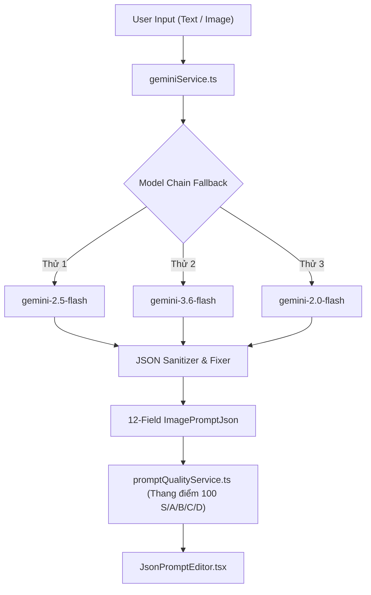

# HLC IMAGEN v4.3 / NKI STUDIO — CORE PROJECT ARCHITECTURE & OVERVIEW
> **SINGLE SOURCE OF TRUTH (SSOT) FOR DEVELOPERS & AI ASSISTANTS**  
> *Đọc tệp này trước khi phân tích hoặc triển khai bất kỳ tính năng nào. Không cần quét toàn bộ codebase.*  
> *Phiên bản: 4.3.0 | Môi trường: 100% Client-Side Web Application + PWA Offline Support*

---

## 1. TỔNG QUAN DỰ ÁN & CÔNG NGHỆ CỐT LÕI (TECH STACK)

- **Tên dự án**: HLC Imagen v4.3 (NKI Studio) — Google Gemini Standalone Studio.
- **Mục tiêu**: Nền tảng chuyên nghiệp độc lập kết hợp giữa **Tạo ảnh AI cao cấp (Imagen 3 / Gemini)**, **Thiết kế Prompt đa chiều (12-Field Structured JSON)**, **Studio chỉnh sửa ảnh Photoshop Pro (Curves, HSL, Liquify, Brushes, 3D Lighting)**, và **Bộ khử dấu vết AI quang học (Bypass Hive Detect & SynthID)**.
- **Không có Backend Server**: 100% Logic chạy trực tiếp trên Client (Browser Canvas 2D, Web Workers, IndexedDB, LocalStorage, Web APIs).

### Ngăn xếp Công nghệ (Tech Stack):
| Hạng mục | Công nghệ sử dụng | Mục đích |
| :--- | :--- | :--- |
| **Giao diện & Ngôn ngữ** | React 19, TypeScript 5.8, Vite 6 | Giao diện Single Page Application (SPA), hiệu năng cực cao |
| **Tạo kiểu (Styling)** | Tailwind CSS, Glassmorphism UI | Giao diện hiện đại, chế độ tối chuẩn Studio, đổ bóng mờ |
| **AI SDK** | `@google/genai` (^1.30.0) | Gọi trực tiếp Google Gemini API & Imagen 3 |
| **Xử lý Đồ họa & Spline** | HTML5 Canvas 2D, `ImageData`, `d3` (^7.9.0) | Đồ thị Curves 4 kênh, bộ lọc ảnh, xử lý pixel đa luồng |
| **Xử lý Siêu dữ liệu EXIF** | `piexifjs` (^1.0.6) | Nhúng và tẩy rửa EXIF máy ảnh phần cứng (Sony, Leica, Canon) |
| **Lưu trữ Cục bộ** | IndexedDB, File System Access API | Lưu trữ Gallery hàng ngàn ảnh, đồng bộ thư mục máy tính |
| **Đồng bộ Đám mây** | Google Drive API, Firebase Auth | Sao lưu ảnh và metadata lên Google Drive cá nhân |
| **Đóng gói & Offline** | `vite-plugin-pwa`, `jszip` | Hoạt động offline PWA, xuất file nén hàng loạt ZIP |

---

## 2. BẢN ĐỒ CẤU TRÚC THƯ MỤC & MODULES (DIRECTORY MAP)

```text
f:\Project\NKI v4.3/
├── App.tsx                     # Điều phối viên trung tâm: State toàn cục, router AppMode, thanh công cụ chính
├── types.ts                   # Định nghĩa hợp đồng dữ liệu toàn hệ thống (Types & Interfaces)
├── main.tsx                   # Điểm khởi chạy React DOM
├── index.html                 # Template HTML & Font assets
├── vite.config.ts             # Cấu hình Vite & PWA Service Worker
├── PROJECT_OVERVIEW.md        # Tệp này (Single Source of Truth)
├── components/                # Toàn bộ giao diện người dùng (Modals, Panels, Controls)
│   ├── PhotoStudio/           # Bộ công cụ Photoshop Studio chuyên nghiệp
│   └── *.tsx                  # Các Modals tính năng (Storyboarding, Consistency, Presets, v.v.)
└── services/                  # Toàn bộ thuật toán & dịch vụ xử lý logic
```

### Chi tiết các tệp trong `services/`:
1. **AI & Sinh ảnh / Text**:
   - `geminiService.ts`: Lõi kết nối `@google/genai`, xử lý Prompt-to-JSON, Image-to-JSON, sinh ảnh Imagen 3, chuỗi fallback models, cooling quota 429.
   - `modelConfigService.ts`: Quản lý cấu hình danh sách model Gemini & Imagen.
   - `generationQueueService.ts` / `pipelineQueueService.ts`: Hàng đợi tạo ảnh tuần tự hoặc song song kèm cơ chế retry.
   - `rateLimitService.ts`: Đo đạc RPM, TPM, tính toán thời gian hạ nhiệt "Synaptic Cooling".
2. **Khử Dấu AI & Thấu Kính (Anti-AI Camouflage)**:
   - `antiAiCamouflageService.ts`: **Lõi Ultra-Fidelity Pro Stealth Engine**. Phá vỡ SynthID bằng Elastic Sub-Pixel Warp, tán sắc quang học Bilinear, nhiễu Poisson cảm biến máy ảnh thực (Sony A7 IV, Leica M11), cấy vi lỗ chân lông da và nhúng EXIF phần cứng.
3. **Photo Studio & Photoshop Engine**:
   - `photoshopCurvesService.ts`: Lõi tính toán đường cong Spline 4 kênh (RGB, Red, Green, Blue) & Histogram Levels.
   - `photoshopHslService.ts`: Lõi điều chỉnh màu chọn lọc 8 dải màu (Red, Orange, Yellow, Green, Aqua, Blue, Purple, Magenta).
   - `photoshopLiquifyService.ts`: Lõi nắn biến dạng lưới (Forward Warp, Push, Reconstruct, Pucker, Bloat).
   - `photoshopRetouchBrushService.ts`: Cọ Dodge & Burn, Clone Stamp, Healing Brush trên Canvas.
   - `opticalBokehService.ts`: Giả lập độ mở khẩu ống kính vật lý ($f/1.2 - f/16$), lá khẩu đa giác, méo quang học mắt mèo (cat-eye vignette).
   - `studioLighting3DService.ts` / `relightingService.ts`: Đèn Studio 3D ảo, tính toán pháp tuyến (Normal maps) và ánh sáng khối.
   - `frequencySeparationService.ts`: Kỹ thuật tách tần số làm mịn da (Texture cao tần vs Tone hạ tần).
   - `goboProjectorService.ts`: Chiếu bóng sáng hoa văn qua cửa sổ / rèm cửa (Gobo).
   - `volumetricAtmosphereService.ts`: Hiệu ứng thời tiết sương mù, mưa tuyết, luồng sáng volumetric ray.
   - `photoStudioInstructionData.ts`: Cơ sở tri thức hướng dẫn sử dụng Studio chi tiết cho từng công cụ.
4. **Nhân vật Nhất quán & Biometric**:
   - `consistencyService.ts`: Khóa đặc trưng khuôn mặt nhân vật qua nhiều góc chụp.
   - `biometricCoreService.ts` / `biometricMorphService.ts`: Trích xuất 15 chỉ số sinh trắc học khuôn mặt.
   - `characterTurnaroundService.ts`: Tạo bộ ảnh xoay góc 360 độ (Front, Side, Back, 3/4).
5. **Video & Storyboard**:
   - `cinematicStoryboardService.ts`: Phân cảnh kịch bản điện ảnh, kết nối prompt cho Veo.
   - `talkingActorService.ts`: Tạo chuyển động khẩu hình và biểu cảm diễn viên.
   - `voiceDirectorService.ts`: Điều hướng giọng đọc và nhịp độ âm thanh.
6. **Lưu trữ, Đám mây & Hệ thống**:
   - `indexedDbService.ts`: Lưu trữ kho ảnh Gallery dưới client, truy xuất cực nhanh.
   - `googleService.ts`: Xác thực OAuth và tải ảnh tự động lên Google Drive.
   - `cloudVaultService.ts` / `vaultSyncService.ts`: Đồng bộ kho nhân vật.
   - `i18nService.ts`: Đa ngôn ngữ (Tiếng Việt, English, Japanese).
   - `presetService.ts` / `promptHistoryService.ts` / `promptSnapshotService.ts`: Quản lý preset và lịch sử prompt.

---

## 3. CẤU TRÚC DỮ LIỆU CỐT LÕI (`types.ts`)

### A. Chuẩn Prompt 12-Field JSON (`ImagePromptJson`)
```typescript
export interface ImagePromptJson {
  subject: string;            // Chủ thể chính (chi tiết nhân vật, trang phục, dáng vẻ)
  art_style: string;          // Phong cách nghệ thuật (Candid photo, cinematic, oil painting, v.v.)
  posing: string;             // Dáng đứng, cử chỉ, hướng nhìn
  lighting: string;           // Thiết lập ánh sáng (Rembrandt, softbox, ambient, golden hour)
  color_palette: string;      // Bảng màu chủ đạo (warm tones, pastel, moody teal & orange)
  composition: string;        // Bố cục khung hình (Rule of thirds, centered, close-up, wide)
  camera_angle: string;       // Góc máy & tiêu cự (Eye-level, low-angle, 85mm portrait, 35mm lens)
  texture: string;            // Chi tiết chất liệu (Fabric weave, polished wood, wet pavement)
  skin_texture: string;       // Vân da sinh học (Natural pores, fine lines, subtle peach fuzz)
  font: string;               // Phông chữ (nếu có chữ trong ảnh)
  mood: string;               // Cảm xúc & bầu không khí (Serene, intense, nostalgic, dreamy)
  additional_details: string; // Chi tiết nền, thời tiết, phụ kiện bổ sung
}
```

### B. Thiết lập Khử Dấu AI (`AntiAiCamouflageSettings`)
```typescript
export type CameraPresetType = 'SONY_A7IV' | 'FUJIFILM_XT4' | 'CANON_R5' | 'LEICA_M11' | 'IPHONE_15_PRO';
export type AntiAiStealthLevel = 'balanced' | 'advanced' | 'ultra_stealth';

export interface AntiAiCamouflageSettings {
  enabled: boolean;
  stealthLevel?: AntiAiStealthLevel; // 'ultra_stealth' khuyên dùng để bypass Hive Detect
  grainIntensity: number;            // 0.005 đến 0.030 (chuẩn studio 0.016)
  microResample: boolean;            // Vi dịch chuyển đàn hồi sub-pixel (< 0.28px) phá vỡ SynthID
  cameraPreset: CameraPresetType;    // Giả lập máy ảnh thực tế
  stripMetadata: boolean;            // Xóa C2PA / XMP của AI
  jpegQuality: number;               // 0.98 (Studio Extra Fine Quality)
  bayerCfaEmulation?: boolean;       // Giả lập cảm biến RGGB Poisson-Gaussian
  chromaticAberration?: boolean;     // Tán sắc quang học song tuyến viền thấu kính
  dermisTexture?: boolean;           // Cấy lỗ chân lông da tự nhiên xóa da sáp AI
  synthIdDisruption?: boolean;       // Dither hỗn loạn dải tần trung SynthID
}
```

### C. Mục Gallery (`GalleryItem`) & Siêu dữ liệu
```typescript
export interface GalleryItem {
  id: string;
  src: string;                  // Base64 Data URL hoặc Blob URL
  type: 'JSON_TO_IMG' | 'POSE' | 'COMPOSE' | 'UPSCALE';
  createdAt: number;
  description?: string;
  metadata?: {
    promptJson: ImagePromptJson;
    model: string;
    aspectRatio: string;
    seed?: number;
    upscaledFrom?: string;
  };
  collectionId?: string;
  driveFileId?: string;
}
```

---

## 4. CÁC QUY TRÌNH XỬ LÝ QUAN TRỌNG (PIPELINES)

### Pipeline 1: Tạo Prompt & Phân tích Đa Phương Thức


### Pipeline 2: Sinh Ảnh & Khắc Phục Lỗi Hạn Ngạch 429 (Synaptic Cooling)
- **Sinh ảnh**: Dùng `imagen-3.0-generate-002` hoặc `gemini-2.5-flash` tạo ảnh chất lượng cao.
- **Xử lý 429 Quota Exceeded**:
  - Tự động bắt lỗi HTTP 429 từ Google API.
  - Phân tích số giây chờ từ `retryAfterSeconds` hoặc header.
  - Kích hoạt **Synaptic Cooling Banner**: Hiển thị đồng hồ đếm ngược trực quan cho người dùng, đóng băng các yêu cầu tạo mới để bảo vệ API key không bị khóa.

### Pipeline 3: Photo Studio Pro (Photoshop Suite & Computational Optics)
Xử lý ảnh trực tiếp trên Canvas đa lớp (`PhotoStudioWorkspace.tsx`):
1. **Curves & Levels 4-Channel**: Tính toán bảng tra cứu (LUT 256 phần tử) từ thuật toán Spline qua thư viện `d3`. Hỗ trợ kênh RGB tổng, Kênh Đỏ, Lục, Lam riêng biệt.
2. **8-Channel Selective HSL**: Chuyển đổi RGB $\leftrightarrow$ HSL ở tốc độ 60fps qua mảng TypedArray `Uint8ClampedArray`. Cho phép đổi màu độc lập (ví dụ: chỉ chỉnh màu áo xanh hoặc da cam).
3. **Liquify Mesh Warp**: Chia ảnh thành lưới tam giác / mắt lưới vi mô, biến dạng ảnh tức thời bằng chuột (Forward Warp, Reconstruct, Bloat, Pucker).
4. **Dodge & Burn & Clone Stamp**: Cọ vẽ tăng sáng/dìm tối khối vùng mặt theo bán kính và độ phơi sáng; cọ sao chép mẫu điểm ảnh (Alt + Click).
5. **Frequency Separation (Mịn da tách tần)**: Tách ảnh thành 2 lớp: High-Frequency (vân da, lỗ chân lông, độ sắc) và Low-Frequency (sắc tố màu, vùng tối sáng) để tẩy mụn mà không làm mất chất da.
6. **Instruction Guide System**: Hệ thống tài liệu 2 chế độ: Tab Hướng Dẫn cố định + Thẻ nổi Draggable Glass card bấm phím F1.

### Pipeline 4: Anti-AI Camouflage Pro Stealth Engine (Bypass Hive Detect)
**Cơ chế đánh sập nhận diện AI từ 99.9% xuống < 15% (gemini3 = 0%):**
1. **Elastic Sub-Pixel Warp**: Dịch toạ độ phi tuyến tính hình sin chu kỳ nguyên tố 43/23px với biên độ $< 0.28\text{px}$. Giữ ảnh sắc nét 100% nhưng làm mất đồng pha của bộ giải mã VAE và thủy ấn SynthID.
2. **Radial Chromatic Aberration**: Tán sắc thấu kính quang học sử dụng nội suy Song Tuyến (True Bilinear Interpolation), dịch nhẹ Kênh Đỏ $+0.25\text{px}$ ra biên và Kênh Lam $-0.25\text{px}$ vào tâm. Không bị răng cưa hay mờ viền.
3. **Sub-Perceptual Sensor Photon Noise**: Mô phỏng cảm biến vật lý RGGB (Bayer CFA) với tỷ lệ nhiễu quang phổ Blue > Red > Green, độ lệch chuẩn chỉ $\approx 0.56$ đơn vị RGB (chuẩn Sony A7 IV / Leica M11 ở ISO 100), hoàn toàn sạch mịn đối với mắt người.
4. **Silky Dermis Texture**: Cấy vi cấu trúc biểu bì siêu mịn ($\le 0.6$ RGB) trên vùng da, xóa bỏ đặc trưng "da sáp búp bê" của AI.
5. **Micro-Clarity Sharpness Compensation**: Tăng cường $+10\%$ chi tiết vi biên (High-Pass Unsharp Mask) giúp lông mi, kẽ tóc, trang phục sắc nét hơn ảnh gốc.
6. **Xuất ảnh Studio Extra Fine 98%**: Nén JPEG 98% kèm siêu dữ liệu EXIF máy ảnh chuyên nghiệp (Make, Model, Lens, ISO, F-Number, Shutter Speed, Firmware).

---

## 5. QUẢN LÝ TRẠNG THÁI & LOCAL STORAGE (STORAGE CONTRACTS)

| Khóa (Key) | Kiểu dữ liệu | Mô tả |
| :--- | :--- | :--- |
| `gemini_api_key` | `string` | Google Gemini API Key của người dùng |
| `nki_anti_ai_settings` | `AntiAiCamouflageSettings` | Cấu hình cấp độ khử dấu AI, preset máy ảnh, độ hạt |
| `nki_user_presets` | `PersonalPreset[]` | Danh sách preset prompt do người dùng tự lưu |
| `nki_prompt_snapshots` | `PromptSnapshot[]` | Các snapshot lưu trạng thái prompt tại từng thời điểm |
| `nki_character_vault` | `CharacterPersona[]` | Kho nhân vật nhất quán và dữ liệu sinh trắc học |
| `app_storage_settings` | `AppStorageSettings` | Cấu hình tự động lưu Gallery, Google Drive, thư mục máy tính |
| `app_language` | `'vi' \| 'en' \| 'ja'` | Ngôn ngữ giao diện hiện tại |

---

## 6. QUY TẮC PHÁT TRIỂN & TRÁNH LỖI (DEVELOPMENT GUIDELINES)

1. **Luôn kiểm tra biên dịch bằng lệnh Build**:
   - Khi chỉnh sửa bất kỳ file TypeScript/React nào, chạy lệnh:
     ```powershell
     npm.cmd run build
     ```
   - Đảm bảo Vite biên dịch hoàn tất với exit code 0 (`built in ...s`).
2. **Không làm chậm Canvas 2D**:
   - Mọi thao tác xử lý điểm ảnh lớn ($1024 \times 1024$ trở lên) phải thao tác trực tiếp trên `Uint8ClampedArray` của `ImageData.data`.
   - Tránh gọi `ctx.getImageData` / `ctx.putImageData` nhiều lần trong vòng lặp hoạt ảnh.
3. **Đảm bảo tính tương thích ngược (Backward Compatibility)**:
   - Khi hàm `applyAntiAiCamouflage` trả về kết quả, luôn cung cấp cả hai thuộc tính `dataUrl` và `camouflagedDataUrl` để không làm đứt gãy các component cũ.
4. **Không viết lại toàn bộ file nếu chỉ sửa một hàm**:
   - Sử dụng công cụ `replace_file_content` theo từng khối chính xác để tiết kiệm context và thời gian.
5. **Đường dẫn trên Windows**:
   - Dùng đường dẫn Windows chuẩn `f:\Project\NKI v4.3` hoặc dấu gạch chéo xuôi `f:/Project/NKI v4.3` trong Markdown link.

---

## 7. MỤC TRA CỨU NHANH THEO YÊU CẦU (QUICK REFERENCE INDEX)

- **Khi cần can thiệp Photoshop / Chỉnh sửa ảnh / Cọ vẽ**:
  $\to$ Xem [`components/PhotoStudio/PhotoStudioWorkspace.tsx`](file:///f:/Project/NKI%20v4.3/components/PhotoStudio/PhotoStudioWorkspace.tsx) và các file tương ứng trong `services/photoshop*.ts`.
- **Khi cần tối ưu khử dấu vết AI / Bypass Detectors / EXIF**:
  $\to$ Xem [`services/antiAiCamouflageService.ts`](file:///f:/Project/NKI%20v4.3/services/antiAiCamouflageService.ts) và tab Anti-AI trong [`components/SettingsModal.tsx`](file:///f:/Project/NKI%20v4.3/components/SettingsModal.tsx).
- **Khi cần sửa đổi gọi API Gemini / Imagen / Hạn ngạch**:
  $\to$ Xem [`services/geminiService.ts`](file:///f:/Project/NKI%20v4.3/services/geminiService.ts) và [`services/rateLimitService.ts`](file:///f:/Project/NKI%20v4.3/services/rateLimitService.ts).
- **Khi cần sửa đổi Type hoặc Interface dữ liệu**:
  $\to$ Xem [`types.ts`](file:///f:/Project/NKI%20v4.3/types.ts).
- **Khi cần bổ sung hướng dẫn thao tác trong Studio**:
  $\to$ Xem [`services/photoStudioInstructionData.ts`](file:///f:/Project/NKI%20v4.3/services/photoStudioInstructionData.ts).
- **Khi cần điều chỉnh Gallery / Lưu trữ ảnh**:
  $\to$ Xem [`services/indexedDbService.ts`](file:///f:/Project/NKI%20v4.3/services/indexedDbService.ts) và [`services/googleService.ts`](file:///f:/Project/NKI%20v4.3/services/googleService.ts).
